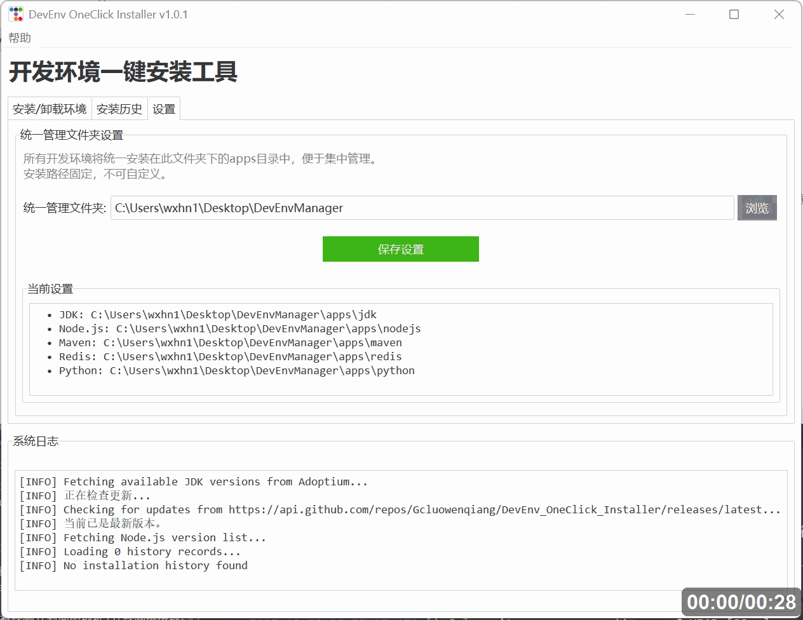

# DevEnv OneClick Installer (开发环境一键安装工具)

## 简介

这是一个基于 Python 的 Windows 11 开发环境一键安装工具。旨在解决重装系统后手动配置开发环境繁琐的问题。
本工具采用“绿色安装”模式：**下载压缩包 -> 解压 -> 配置环境变量**，避免了传统安装程序的繁琐向导。

## 功能特性

*   **支持环境**:
    *   **JDK**: 支持 8 / 11 / 17 / 21 (LTS) 及所有官方版本 - 来源: Eclipse Adoptium (实时动态获取)
    *   **Node.js**: 支持所有 LTS 版本 (如 v18, v20, v22) - 来源: nodejs.org 官方源 (实时获取)
    *   **Maven**: 支持 3.3.x - 3.9.x 全系列 - 来源: Apache Archive
        *   支持自定义本地仓库路径 (Local Repository)
    *   **Redis**: 支持 Windows 版 (tporadowski fork) 5.0.14 - 来源: GitHub Release
        *   支持自定义端口号、密码
        *   支持注册为 Windows 系统服务 (开机自启)
    *   **Python**: 支持 3.8 - 3.12 (Embeddable版) - 来源: Python.org (自动集成 pip)
*   **核心功能**:
    *   **统一管理**: 支持自定义管理文件夹
    *   **自动下载**: 支持官方源/镜像源，包含断点续传和自动重试机制
    *   **自动解压**: 自动识别解压路径，处理嵌套目录
    *   **环境配置**: 自动设置 Windows 用户环境变量 (`JAVA_HOME`, `NODE_HOME`, `MAVEN_HOME`, `REDIS_HOME`, `PYTHON_HOME`, `PATH`)
    *   **一键卸载**: 支持安全卸载已安装的环境，自动清理文件、环境变量及系统服务。
    *   **无干扰**: 仅修改当前用户配置，无需管理员权限
    *   **自动更新**: 支持从 GitHub 检查最新版本，自动下载并安装更新，更新后首次启动显示更新日志。


## 界面展示



## 运行依赖

*   Windows 10 / 11
*   Python 3.8+ (如果运行源码)

## 快速开始 (源码运行)

1.  安装依赖:
    ```bash
    pip install -r requirements.txt
    ```

2.  运行程序:
    ```bash
    python main.py
    ```

3.  在界面中选择要安装的环境（如 Python），选择版本，点击“开始安装”。
    *   安装目录会自动设置为统一管理文件夹下的对应子目录（可在"设置"标签页中修改统一管理文件夹路径）

### 卸载环境

1.  在界面顶部选择 **"卸载环境"** 模式。
2.  选择要卸载的环境类型（如 Redis）。
3.  选择该环境所在的目录（必须是包含可执行文件的根目录）。
4.  点击 **"开始卸载"**，确认后即可清理。

## 打包说明 (生成 .exe)

为了在无 Python 环境的机器上运行，可以使用 PyInstaller 进行打包。

1.  确保已安装 `pyinstaller`:
    ```bash
    pip install pyinstaller
    ```

2.  执行打包命令:
    ```bash
    python -m PyInstaller --noconsole --onefile --name="DevEnvInstaller" --icon=icon.ico main.py
    ```
    *(注: 如果没有 icon.ico，请去掉 --icon 参数)*

3.  打包完成后，在 `dist` 目录下找到 `DevEnvInstaller.exe` 即可分发使用。

## 目录结构

```
.
├── core/               # 核心逻辑
│   ├── env_manager.py  # 安装器基类 (含下载/解压)
│   ├── system_config.py# 环境变量管理 (WinReg操作)
│   ├── config.py       # 配置管理 (统一管理文件夹设置)
│   └── logger.py       # 日志模块
├── gui/                # 界面逻辑
│   └── main_window.py  # 主窗口 (Tkinter + ttkbootstrap)
├── impl/               # 具体环境实现
│   ├── jdk.py          # JDK 安装实现
│   ├── node.py         # Node.js 安装实现 (含动态版本获取)
│   ├── maven.py        # Maven 安装实现
│   ├── redis.py        # Redis 安装实现
│   └── python.py       # Python 安装实现 (含pip配置)
├── logs/               # 运行日志
├── main.py             # 入口文件
└── requirements.txt    # 依赖列表
```

## 注意事项

*   **环境变量**: 本工具修改的是**当前用户**的环境变量 (`HKEY_CURRENT_USER\Environment`)。
*   **生效时间**: 修改环境变量后，已打开的 CMD/PowerShell 窗口可能需要重启才能生效。
*   **Python**: 
    *   使用的是 **Windows Embeddable Package** (绿色免安装版)。
    *   工具会**自动解锁 pip** (修改 `._pth` 文件并下载 `get-pip.py`)，确保你可以直接使用 `pip install`。
    *   安装后目录包含 `Scripts` 文件夹，已自动加入 PATH。
